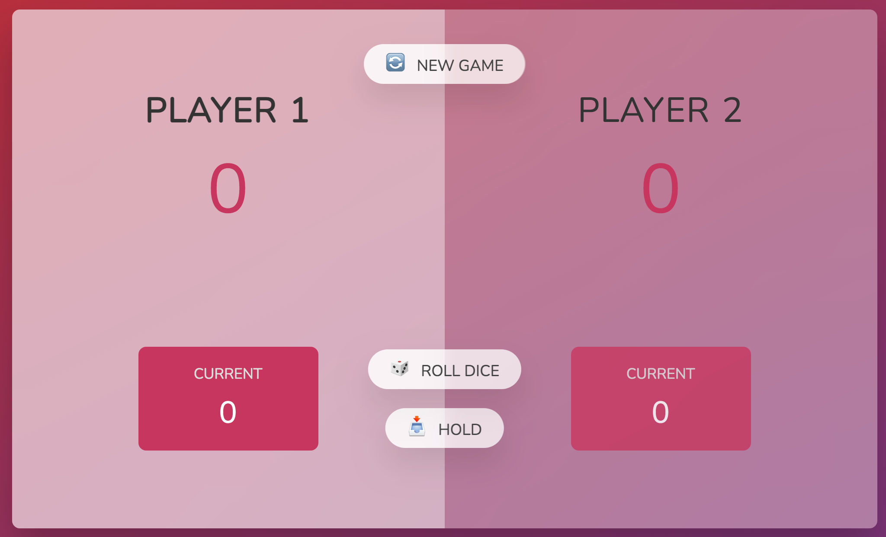

<h1 align="center">Pig-Dice-Game</h1>

 
<h2>A simple dice game based on holding your stakes.</h2>

The game is a practice code from Jonas Schmetmann's Complete JavaScript Course on Udemy. The game is solely based on learning Javascript. The game works on Principle of holding your stakes low, you have to guess a Secret Number. The game lets you know if your value is high or lower than the Secret Number and reduces points based on the incorrect guesses.

<h2>Overview and Rules of the Project </h2>
<li>The Game is played between 2 players</li>
<li>A player roles the dice and can continue till he roles the no.1</li>
<li>The player can also choose to hold his turn passing the Dice to the next player</li>
<li>The points get added to the main-score and First to 100 wins.</li>

<h2>Concepts used and learned during the project</h2>
<li>Calling a class from HTML in JavaScript</li>
<li>Handling Event Listners</li>
<li>Handling CSS properties from Javascript</li>
<li>Optimizing Code for better performance</li>
<li>calling element by #id</li>
<li>Math.random function application</li>

